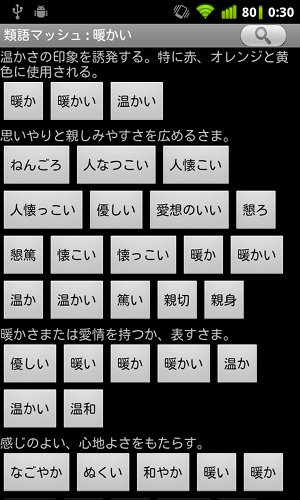

検索しよう
----------

画面右上の「虫めがねアイコン |search_icon| 」をタップすると、次のような検索ダイアログが現れます。

.. |search_icon| image:: search_icon.png

このダイアログから類語の検索を行うことができます。類語が見つからないときは……ごめんなさい、他の単語を試してみて下さい。

検索結果を取り込もう
--------------------

類語が見つかると次のような画面になります。この画面は「暖かい」という単語で類語検索をしたところです。

沢山の類語が表示された類語ボタンが現れました。類語ボタンの上には、類語をまとめる意味の見出しが現れます。
意味を参考に類語を探しましょう。

いいな、と思った類語のボタンを押せば、その単語がクリップボードにコピーすることができます。

再検索しよう
------------

この類語、ちょっといい感じだけど、これじゃない……、そんなときはその類語ボタンを「長押し」してみましょう。
その単語で類語検索をすることができます。

ボタンの長押しで次々と単語をジャンプして、簡単に類語の世界を旅することができますよ。

マッシュルーム
--------------

このアプリ、普通に起動して使うこともできますが、「マッシュルーム機能」に対応したIMEから呼び出して使うこともできるんです。
マッシュルーム機能から呼び出した場合は、呼び出し元の単語が自動的に検索されます。
マッシュルーム機能から呼び出した場合は類語ボタンを押して検索結果を取り込むと、クリップボードではなくて、呼び出し元のアプリに結果が渡るようになっています。

さあ始めよう
------------

下のボタンを押すと検索ダイアログが表示されます。気になる単語の検索から始めましょう。

